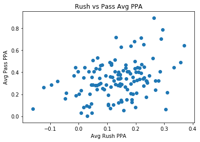
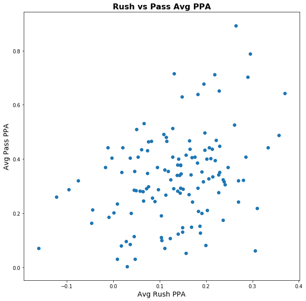
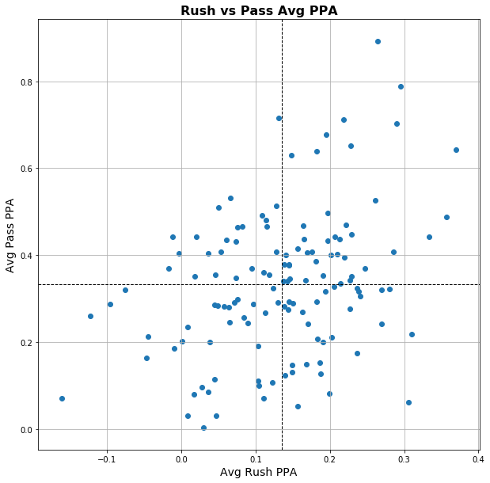
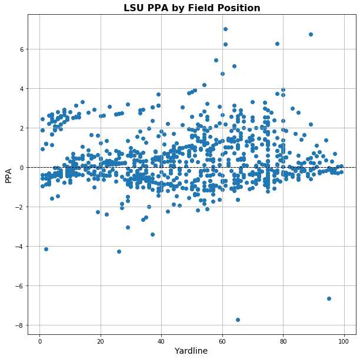

# Introduction to College Football Data Using Python

If you are reading this - you enjoy college football. Or you may just enjoy working with different types of data. Hopefully, you're like me and like both. I am self-taught in Python, so I am by no means the end all be all expert of how to approach things, but if I can figure it out, you can to.

This guide is a fork of Parker Flemings ([@statsowar](https:twitter.com/statsowar) on Twitter) guide "[Introduction to College Football Data with R and cfbscrapR](https://gist.github.com/spfleming/2527a6ca2b940af2a8aa1fee9320171d)". We will go through the same excercises he did, simply with the Python equivalent to his R masterpiece.

If you have any questions - or see any errors - shoot me a tweet [@GJMcClintock](https://twitter.com/gjmcclintock). This is very pragmagtically done - if it works, it works. None of what I presently deal with is very resource intensive, so I am sure there are much more efficient ways to get the job done. If you have suggestions on that front, please let me know!

## Setting up Python

The easiest way to set up Python is to head over and grab [Anaconda](https://www.anaconda.com/distribution/). This will install Python for you as well as give you a few options for writing you code. It can also install R and R Studio if you want to go through Parker's guide as well.

A lot of people work directly in Jupyter Notebook. It makes a nice clean package and will let you add pretty comments and save it all to a PDF to make a nice packaged report. For doing quick a dirty work, I suggest Spyder - it is very similar to R Studio and has a great variable explorer to see all the variables you have and even what those values are.

After you you install Anaconda, open up your command prompt (Windows) or terminal (Mac/Linux). We need to install a few more libraries.

Professionally - throwing everything into one enivronment is discouraged. But in our case - use facing software isn't a concern. Let's get messy.

To install a new package - find the name of it an then we will use the command 'pip install {package}'

We will need to run the following for our guide:

pip install pandas # (this should be included with Anaconda)
pip install scipy #(should be included)
pip install numpy 3(should be included)
pip install requests
pip install json
pip install matplotlib

#Optional:
pip install tqdm #(this creates status bars for writing loops).

Run these line by line. Also here is a good place to point out that a '#' creates a comment in Python. In Spyder you can also comment entire blocks going to Edit -> Add/Remove Block Comment (CMD + 4/5 on Mac, CTRL + 4/5 on Windows). This will add a # to every line you selected.

## Getting the Data

Now that we have our environment ready to go, we can create a file. Open Anaconda Navigator, Launch Spyder and create a new file. Save it as whatever you like using .py as the file extension.

First lets import the packages we will use and then put in a break to start diving our project into cells:


```python
import pandas as pd
import numpy as np
import requests
import json
import matplotlib.pyplot as plt
from tqdm import tqdm as tqdm # this is optional but I like having status bars
```

Under this, type '#%%' and you will see a line go all the way across the screen. This will let you run your code in sections without having to select it. Every time we use one of these clode blocks, we can simply put the cursor in the block and hit CTRL + Enter (Windows) or CMD + Enter (Mac).

We are going to write a loop to get all of the play by play (pbp) data for the 2019 season. All documentation of the different options of data we can get are found at [api.collegefootballdata.com](https://api.collegefootballdata.com/api/docs/?url=/api-docs.json#/plays/getPlays). This will tell you what parameters of your data request are required and which ones are not. You can also play around to see what it gives you and find what works - then write it into your code.

Looking at the documentation, we see we only need to input the year - but that is a lot of data to grab in one bite. So we will loop through each week of the season and build our dataframe.


```python
# Set the season we want
year = 2019

# Grab weeks 0-15. Range is not inclusive at the end.
# This will generate a list of numbers - 0,1,2,3,4,5,6
# 7,8,9,10,11,12,13,14,15 - that we can use to loop through. 
weeks = list(range(0,16))

# Let's create a placeholder for the reponse we get from our request
# as well as the dataframe where we will put the data.
pbp_req = []
pbp = pd.DataFrame()

# Now lets loop through (for every week in our list 'weeks')
# If you decided against tqdm, just change this line to be
# 'for week in weeks:'
for week in tqdm(weeks, desc = 'fetch plays'):
    
    # This is where we say what variables to pass - both of them
    # were set previously - we set the year, and the loop set week.
    parameters = {"year":year, "week":week}
    
    # Here we make our actual request. Notice the URL goes to /plays.
    # From the documentation you can grab any other available data in the
    # Same format.
    pbp_req = requests.get("https://api.collegefootballdata.com/plays", params = parameters)
    
    # Let's add the week we just grabbed to our dataframe with all the other weeks
    # If the week had no data (say you put 0-100 instead of 0-15) it will get and error
    # So we tell the loop to keep going if this happens. Ignoring errors isn't generally
    # a good idea. But if we are grabbing data and we don't know what year is the earliest
    # with this data available, we can put in an early number and be sure to catch it.
    # Or - we can run weeks 0-15 and get the whole season to date, without worrying about
    # it breaking from trying to get weeks that haven't happened yet.
    try:
        pbp =  pbp.append(json.loads(pbp_req.text))
    except IndexError:
        pass
    continue
```

    fetch plays: 100%|██████████| 16/16 [00:17<00:00,  1.05s/it]


Now that you have the data there (it took 17 seconds for me), we can take a look at the data that is available. If you look in the upper right at your variable explorer, you can see we have the object 'pbp' of type 'DataFrame'. It has 152,731 rows, one for each play of the season. That's a lot to look at, so we just want to check out a sample. To do this we can use head(x) or tail(x) to give us the first or last x number of rows. The default is 5 if you just use head() or tail(). 

Let's put in a cell break (#%%) and grab the first 10:


```python
pbp.head(10)
```


<div>
<style scoped>
    .dataframe tbody tr th:only-of-type {
        vertical-align: middle;
    }

    .dataframe tbody tr th {
        vertical-align: top;
    }

    .dataframe thead th {
        text-align: right;
    }
</style>
<table border="1" class="dataframe">
  <thead>
    <tr style="text-align: right;">
      <th></th>
      <th>id</th>
      <th>offense</th>
      <th>offense_conference</th>
      <th>defense</th>
      <th>defense_conference</th>
      <th>home</th>
      <th>away</th>
      <th>offense_score</th>
      <th>defense_score</th>
      <th>drive_id</th>
      <th>period</th>
      <th>clock</th>
      <th>yard_line</th>
      <th>down</th>
      <th>distance</th>
      <th>yards_gained</th>
      <th>play_type</th>
      <th>play_text</th>
      <th>ppa</th>
    </tr>
  </thead>
  <tbody>
    <tr>
      <td>0</td>
      <td>401110720101858401</td>
      <td>Alabama</td>
      <td>SEC</td>
      <td>Duke</td>
      <td>ACC</td>
      <td>Alabama</td>
      <td>Duke</td>
      <td>0</td>
      <td>0</td>
      <td>4011107201</td>
      <td>1</td>
      <td>{'minutes': 14, 'seconds': 15}</td>
      <td>23</td>
      <td>2</td>
      <td>9</td>
      <td>2</td>
      <td>Pass Reception</td>
      <td>Tua Tagovailoa pass complete to Jerome Ford fo...</td>
      <td>-0.227264862029380229</td>
    </tr>
    <tr>
      <td>1</td>
      <td>401110720101849902</td>
      <td>Duke</td>
      <td>ACC</td>
      <td>Alabama</td>
      <td>SEC</td>
      <td>Alabama</td>
      <td>Duke</td>
      <td>0</td>
      <td>0</td>
      <td>4011107201</td>
      <td>1</td>
      <td>{'minutes': 15, 'seconds': 0}</td>
      <td>65</td>
      <td>1</td>
      <td>10</td>
      <td>22</td>
      <td>Kickoff</td>
      <td>AJ Reed kickoff for 65 yds , Henry Ruggs III r...</td>
      <td>None</td>
    </tr>
    <tr>
      <td>2</td>
      <td>401110720101874201</td>
      <td>Alabama</td>
      <td>SEC</td>
      <td>Duke</td>
      <td>ACC</td>
      <td>Alabama</td>
      <td>Duke</td>
      <td>0</td>
      <td>0</td>
      <td>4011107201</td>
      <td>1</td>
      <td>{'minutes': 12, 'seconds': 57}</td>
      <td>19</td>
      <td>4</td>
      <td>13</td>
      <td>3</td>
      <td>Punt</td>
      <td>Will Reichard punt for 39 yds , Josh Blackwell...</td>
      <td>None</td>
    </tr>
    <tr>
      <td>3</td>
      <td>401110720101855301</td>
      <td>Alabama</td>
      <td>SEC</td>
      <td>Duke</td>
      <td>ACC</td>
      <td>Alabama</td>
      <td>Duke</td>
      <td>0</td>
      <td>0</td>
      <td>4011107201</td>
      <td>1</td>
      <td>{'minutes': 14, 'seconds': 46}</td>
      <td>22</td>
      <td>1</td>
      <td>10</td>
      <td>1</td>
      <td>Rush</td>
      <td>Jerome Ford run for 1 yd to the Alab 23</td>
      <td>-0.51421952939679995</td>
    </tr>
    <tr>
      <td>4</td>
      <td>401110720101866901</td>
      <td>Alabama</td>
      <td>SEC</td>
      <td>Duke</td>
      <td>ACC</td>
      <td>Alabama</td>
      <td>Duke</td>
      <td>0</td>
      <td>0</td>
      <td>4011107201</td>
      <td>1</td>
      <td>{'minutes': 13, 'seconds': 30}</td>
      <td>25</td>
      <td>3</td>
      <td>7</td>
      <td>-6</td>
      <td>Sack</td>
      <td>Tua Tagovailoa sacked by Koby Quansah for a lo...</td>
      <td>-0.337947526010106361</td>
    </tr>
    <tr>
      <td>5</td>
      <td>401110720101874901</td>
      <td>Duke</td>
      <td>ACC</td>
      <td>Alabama</td>
      <td>SEC</td>
      <td>Alabama</td>
      <td>Duke</td>
      <td>0</td>
      <td>0</td>
      <td>4011107202</td>
      <td>1</td>
      <td>{'minutes': 12, 'seconds': 50}</td>
      <td>55</td>
      <td>1</td>
      <td>10</td>
      <td>-1</td>
      <td>Rush</td>
      <td>Deon Jackson run for a loss of 1 yard to the D...</td>
      <td>-1.3838406426271828</td>
    </tr>
    <tr>
      <td>6</td>
      <td>401110720101877201</td>
      <td>Duke</td>
      <td>ACC</td>
      <td>Alabama</td>
      <td>SEC</td>
      <td>Alabama</td>
      <td>Duke</td>
      <td>0</td>
      <td>0</td>
      <td>4011107202</td>
      <td>1</td>
      <td>{'minutes': 12, 'seconds': 27}</td>
      <td>56</td>
      <td>2</td>
      <td>11</td>
      <td>4</td>
      <td>Rush</td>
      <td>Deon Jackson run for 4 yds to the Duke 48</td>
      <td>-0.1489327290029632</td>
    </tr>
    <tr>
      <td>7</td>
      <td>401110720101885001</td>
      <td>Duke</td>
      <td>ACC</td>
      <td>Alabama</td>
      <td>SEC</td>
      <td>Alabama</td>
      <td>Duke</td>
      <td>0</td>
      <td>0</td>
      <td>4011107202</td>
      <td>1</td>
      <td>{'minutes': 11, 'seconds': 49}</td>
      <td>52</td>
      <td>4</td>
      <td>7</td>
      <td>35</td>
      <td>Punt</td>
      <td>Austin Parker punt for 40 yds, fair catch by J...</td>
      <td>None</td>
    </tr>
    <tr>
      <td>8</td>
      <td>401110720101884401</td>
      <td>Duke</td>
      <td>ACC</td>
      <td>Alabama</td>
      <td>SEC</td>
      <td>Alabama</td>
      <td>Duke</td>
      <td>0</td>
      <td>0</td>
      <td>4011107202</td>
      <td>1</td>
      <td>{'minutes': 11, 'seconds': 55}</td>
      <td>52</td>
      <td>3</td>
      <td>7</td>
      <td>0</td>
      <td>Pass Incompletion</td>
      <td>Quentin Harris pass incomplete to Deon Jackson</td>
      <td>-0.77989188411396164</td>
    </tr>
    <tr>
      <td>9</td>
      <td>401110720101887501</td>
      <td>Alabama</td>
      <td>SEC</td>
      <td>Duke</td>
      <td>ACC</td>
      <td>Alabama</td>
      <td>Duke</td>
      <td>0</td>
      <td>0</td>
      <td>4011107203</td>
      <td>1</td>
      <td>{'minutes': 11, 'seconds': 24}</td>
      <td>23</td>
      <td>2</td>
      <td>4</td>
      <td>3</td>
      <td>Fumble Recovery (Opponent)</td>
      <td>Jerome Ford run for 3 yds to the Alab 26 Jerom...</td>
      <td>None</td>
    </tr>
  </tbody>
</table>
</div>


If you are in Jupyter Notebook, you will see a nice, clean formatted table that you can scroll left and right. Spyder, however will just give you the first column, a bunch of dots and the last column because it's so big.

Instead, lets double click on the 'pbp' object to take a look at what we have inside. There we can scroll, sort, and see the different types of data in the dataframe. If this is too slow on your machine, run:

pbp_sample = pbp.head(25)

Then double click the pbp_sample variable. It should load quickly since there's only 25 rows.

That's a lot of columns, lets try just displaying a list of them all to see which ones we want to use:


```python
pbp.dtypes
```


    id                    object
    offense               object
    offense_conference    object
    defense               object
    defense_conference    object
    home                  object
    away                  object
    offense_score          int64
    defense_score          int64
    drive_id              object
    period                 int64
    clock                 object
    yard_line              int64
    down                   int64
    distance               int64
    yards_gained           int64
    play_type             object
    play_text             object
    ppa                   object
    dtype: object


We have a few whole numbers (int64) but mostly have text objects. In Parker's guide, there were a few more pieces of data that were built in thanks to the great work of Mayappan Subbaiah. Sadly, we don't have those available in the API.

These should all be explanatory to us, other than PPA - that is 'Predicted Points Added', a similar measure to the EPA in Parker's guide.

Let's take a look at the different play types, by using the unique() function:


```python
pbp.play_type.unique()

# or pbp['play_type'].unique()
```


    array(['Pass Reception', 'Kickoff', 'Punt', 'Rush', 'Sack',
           'Pass Incompletion', 'Fumble Recovery (Opponent)', 'Penalty',
           'Field Goal Missed', 'End Period', 'Passing Touchdown',
           'Rushing Touchdown', 'Field Goal Good', 'Timeout',
           'Pass Interception Return', 'Fumble Recovery (Own)',
           'Blocked Field Goal', 'End of Half',
           'Interception Return Touchdown', 'Kickoff Return (Offense)',
           'Blocked Punt', 'Kickoff Return Touchdown',
           'Fumble Return Touchdown', 'Safety', 'Punt Return Touchdown',
           'Uncategorized', 'placeholder', 'Missed Field Goal Return',
           'Missed Field Goal Return Touchdown', 'Defensive 2pt Conversion',
           'Blocked Punt Touchdown', 'Two Point Rush'], dtype=object)


That's not very pretty. Let's clean it up a bit and try using a new package to print it out with line breaks:


```python
import pprint as pp
pp.pprint(pbp.play_type.unique().tolist())
```

    ['Pass Reception',
     'Kickoff',
     'Punt',
     'Rush',
     'Sack',
     'Pass Incompletion',
     'Fumble Recovery (Opponent)',
     'Penalty',
     'Field Goal Missed',
     'End Period',
     'Passing Touchdown',
     'Rushing Touchdown',
     'Field Goal Good',
     'Timeout',
     'Pass Interception Return',
     'Fumble Recovery (Own)',
     'Blocked Field Goal',
     'End of Half',
     'Interception Return Touchdown',
     'Kickoff Return (Offense)',
     'Blocked Punt',
     'Kickoff Return Touchdown',
     'Fumble Return Touchdown',
     'Safety',
     'Punt Return Touchdown',
     'Uncategorized',
     'placeholder',
     'Missed Field Goal Return',
     'Missed Field Goal Return Touchdown',
     'Defensive 2pt Conversion',
     'Blocked Punt Touchdown',
     'Two Point Rush']


Much better. 

You'll notice that so far we have only used one equals sign in everything we've done. That SETS the value to the variable. If we want to COMPARE we use the double-equals (==). To check NOT EQUAL TO we can use !=. Greater than, less than, and greater/less than or equal to are still standard (>,<, >=,<=).

We just want to look at offensive plays, so lets make a list of those play types and then filter for them. If we want to add a flag for run or pass, we could do that too, but it might take some more work as some of these are ambiguous (was the ball fumbled on a run or pass play?) or we have to look at the play text to see the penalty was (pass interference is a pass, but was holding on a run or pass?). Let's just grab all offensive plays for now.


```python
off_play_types = ['Pass Reception',
 'Rush',
 'Sack',
 'Pass Incompletion',
 'Fumble Recovery (Opponent)',
 'Passing Touchdown',
 'Rushing Touchdown',
 'Pass Interception Return',
 'Fumble Recovery (Own)',
 'Interception Return Touchdown',
 'Fumble Return Touchdown']

off_plays = pbp[pbp['play_type'].isin(off_play_types)].copy()
excl_plays = pbp[~pbp['play_type'].isin(off_play_types)].copy()
```

Once we made our list, we can use it to get both our plays and what we left out. The only difference is we need to add a '~' in front of our isin to tell Python to "give us the opposite result". 

We also added .copy() to the end of it. This makes an entire new dataframe. If you don't add .copy(), you will get a "slice". This means that if you change something in any of the dataframes, the records will get adjusted in the original as well. If I do something to off_plays, I don't want it to happen on pbp - so I made a copy.

If you don't copy, you may get some warnings as you try to do different things. Just be aware of this (and in our case, usually copy).

## Creating Some Stats

Now that we have our data, let's do something fun with it! First, we're going to get YPA (Yards Per Attempt) and YPC (Yards Per Carry).

This will take a few steps:

1. Add run/pass flags
2. Group the plays by team and get the mean yards gained for each run, pass, and sum the total number of plays.
3. Filter out all teams with fewer than 300 plays (This will get rid of all the FCS teams that played 1 or 2 games)
4. Print our nice results


```python
# Add flag for run or pass
off_plays.loc[(off_plays['play_type'].str.contains('Pass')), 'pass'] = 1
off_plays.loc[(off_plays['play_type'].str.contains('Interception')), 'pass'] = 1
off_plays.loc[(off_plays['play_type'].str.contains('Sack')), 'pass'] = 1
off_plays.loc[(off_plays['play_text'].str.contains('pass')), 'pass'] = 1
off_plays.loc[(off_plays['play_type'].str.contains('Rush')), 'rush'] = 1
off_plays.loc[(off_plays['play_text'].str.contains('rush')), 'rush'] = 1

off_plays.loc[(off_plays['play_type'].str.contains('Interception')), 'yards_gained'] = 0

flags_na = {'rush':0, 'pass':0}

off_plays.fillna(value=flags_na, inplace=True)

```

What's going on here:

To set a conditional field in Pandas requires a specific syntax (for the way we just did it). Remember that to select something in a data frame, we put what we want in brackets. So if we want a single column, we can just put 

off_plays\['play_type'\]

If we wanted multiple columns, we put in a list of columns inside the brackets:

off_plays\[\['play_type','down','distance'...etc\]\].

We can also filter things this way like we did when subset the data earlier.

If you want to create a conditional column, you do the following to take this a step further:

data.loc\[(condition in parenthesis),'column to add in quotes'\] = 'value'

The '.loc' tells pandas to evaluate every individual row in the dataframe. Then inside the () we are saying "check the play_type column, and if the string contains the phrase X , set 'rp' to Y". Because we did contains instead of equals, we don't have to do it for every possible play type. By checking for "Pass", we cover Pass Complete, Pass Incompletion, Passing Touchdown, and Pass Interception. We also check play_text for the words 'rush' and 'pass' to catch anything else.

Lastly, we set yards_gained to be 0 for interceptions. While an adjusted YPA calculation might include that, interception return yards do not count against a QB's passing yards (but they are calculated in our data).

Then we are filling in the rush and pass columns for all the other plays that didn't match to be 0. On the fillna line, try running it without inplace=True and see what happens. This is a useful tool to remember.

Note on Sacks: Official stats record them as a rush by the quarterback, but if it's a sack, it was a designed pass play, but it wasn't an attempt. I set them as a pass attempt here, and will filter them out of our pass data. This cleans up our rushing efficiency. We could also make it a run and filter it out of the designed runs. Half the fun is deciding how you think you can improve the standard metrics to gain more insight.

In the R tutorial, you see the nice summarise function in R that lets you conditionally roll up columns. In Python, you can use Pandas to groupby and do aggregates, but it is clunky to do it with multiple conditions on different columns.

We have two choices here - and I'll show both. One is to do each of them separately, then merge the dataframes. Or we can write a function where we have more flexibility and can pass our entire dataframe and apply the calculations.


```python
# First - calculate separately and merge


plays = off_plays.groupby('offense').agg({'yards_gained':'count'})
plays.rename(columns={'yards_gained':'Plays'}, inplace=True)

attempts = off_plays[(off_plays['pass'] == 1) & (off_plays['play_type'] != 'Sack')]
ypa = attempts.groupby('offense').agg({'yards_gained':'mean'})
ypa.rename(columns={'yards_gained':'YPA'}, inplace=True)

rushes = off_plays[(off_plays['rush'] == 1)]
ypc = rushes.groupby('offense').agg({'yards_gained':'mean'})
ypc.rename(columns={'yards_gained':'YPC'}, inplace=True)


offense = plays.merge(ypa, left_index= True,right_index= True).merge(ypc, left_index= True,right_index= True)
offense = offense[offense['Plays'] > 300].copy()
```

Once we group by offense and filter the other datapoints, we can merge everything together. After grouping, the offense column with now be the index. So we tell pandas to merge everything on the indices since they are all the same. The aggregate function will keep the column name the same - so we need rename them. We use the inplace=True to set the name change.

Now let's look at what this would be like if we wrote a function to put all of these steps into one nice reusable step:


```python
# Function method to summarize Plays, YPA and YPC

def calcs(x):
      names = {'Plays': x['yards_gained'].count(),
               'YPA': x[(x['pass'] == 1) & (x['play_type']!= 'Sack')]['yards_gained'].mean(),
               'YPC' :x[x['rush'] == 1]['yards_gained'].mean()
                }
      return pd.Series(names)
  
offense =  off_plays.groupby('offense').apply(calcs)

# Filter out FCS Games

offense = offense[offense['Plays'] > 300].copy()
```

This did the same thing as we did before, but we made a set of calculations that we could do on an entire dataframe outside of the function, but couldn't do it to each group. By creating a function, we are able to make our groups, then apply the calculations to each of the groups.

When we say "x" inside the function, it means that it will do the function on whatever data it receives. So we don't need to have our dataframe named x, that is just a variable for the function to know "do all of this based on the dataframe you got, whatever it may be". If we were missing any of the columns we referenced in our function, it would fail when trying to apply it to our dataframe.

Let's print out what we've got sorted by YPA:


```python
offense.sort_values(by='YPA', ascending=False)
```


<div>
<style scoped>
    .dataframe tbody tr th:only-of-type {
        vertical-align: middle;
    }

    .dataframe tbody tr th {
        vertical-align: top;
    }

    .dataframe thead th {
        text-align: right;
    }
</style>
<table border="1" class="dataframe">
  <thead>
    <tr style="text-align: right;">
      <th></th>
      <th>Plays</th>
      <th>YPA</th>
      <th>YPC</th>
    </tr>
    <tr>
      <th>offense</th>
      <th></th>
      <th></th>
      <th></th>
    </tr>
  </thead>
  <tbody>
    <tr>
      <td>Air Force</td>
      <td>800.0</td>
      <td>13.701754</td>
      <td>5.265060</td>
    </tr>
    <tr>
      <td>Navy</td>
      <td>812.0</td>
      <td>12.000000</td>
      <td>6.484761</td>
    </tr>
    <tr>
      <td>Oklahoma</td>
      <td>882.0</td>
      <td>11.255747</td>
      <td>6.627723</td>
    </tr>
    <tr>
      <td>Alabama</td>
      <td>786.0</td>
      <td>10.746073</td>
      <td>5.407216</td>
    </tr>
    <tr>
      <td>LSU</td>
      <td>923.0</td>
      <td>10.715789</td>
      <td>5.704327</td>
    </tr>
    <tr>
      <td>...</td>
      <td>...</td>
      <td>...</td>
      <td>...</td>
    </tr>
    <tr>
      <td>Old Dominion</td>
      <td>806.0</td>
      <td>5.728232</td>
      <td>4.163043</td>
    </tr>
    <tr>
      <td>Bowling Green</td>
      <td>836.0</td>
      <td>5.663690</td>
      <td>4.407098</td>
    </tr>
    <tr>
      <td>Vanderbilt</td>
      <td>744.0</td>
      <td>5.627297</td>
      <td>5.181818</td>
    </tr>
    <tr>
      <td>UMass</td>
      <td>820.0</td>
      <td>5.267857</td>
      <td>4.271357</td>
    </tr>
    <tr>
      <td>Northwestern</td>
      <td>838.0</td>
      <td>4.806452</td>
      <td>4.854545</td>
    </tr>
  </tbody>
</table>
<p>130 rows × 3 columns</p>
</div>


Now we should add the Predicted Points Added (since we don't have EPA, but this is similar). We can also add total Yards Per Play. Lets rework our function and try it again:


```python
# Rework of Function to factor Predicted Points and Yards Per Play
def calcs(x):
      names = {'Plays': x['yards_gained'].count(),
               'YPA': x[(x['pass'] == 1) & (x['play_type']!= 'Sack')]['yards_gained'].mean(),
               'YPC' :x[x['rush'] == 1]['yards_gained'].mean(),
               'PPA_Pass': x[(x['pass'] == 1) & (x['play_type']!= 'Sack')]['ppa'].mean(),
               'PPA_Rush' :x[(x['rush'] == 1)]['ppa'].mean(),
               'YPP' : x['yards_gained'].mean()
                }
      return pd.Series(names)
  
offense =  off_plays.groupby('offense').apply(calcs)

# Filter out FCS Games

offense = offense[offense['Plays'] > 300].copy()

offense
```


<div>
<style scoped>
    .dataframe tbody tr th:only-of-type {
        vertical-align: middle;
    }

    .dataframe tbody tr th {
        vertical-align: top;
    }

    .dataframe thead th {
        text-align: right;
    }
</style>
<table border="1" class="dataframe">
  <thead>
    <tr style="text-align: right;">
      <th></th>
      <th>Plays</th>
      <th>YPA</th>
      <th>YPC</th>
      <th>PPA_Pass</th>
      <th>PPA_Rush</th>
      <th>YPP</th>
    </tr>
    <tr>
      <th>offense</th>
      <th></th>
      <th></th>
      <th></th>
      <th></th>
      <th></th>
      <th></th>
    </tr>
  </thead>
  <tbody>
    <tr>
      <td>Air Force</td>
      <td>800.0</td>
      <td>13.701754</td>
      <td>5.265060</td>
      <td>0.892521</td>
      <td>0.264148</td>
      <td>6.450000</td>
    </tr>
    <tr>
      <td>Akron</td>
      <td>725.0</td>
      <td>5.828715</td>
      <td>3.465649</td>
      <td>0.069808</td>
      <td>-0.160522</td>
      <td>4.155862</td>
    </tr>
    <tr>
      <td>Alabama</td>
      <td>786.0</td>
      <td>10.746073</td>
      <td>5.407216</td>
      <td>0.651361</td>
      <td>0.227803</td>
      <td>7.820611</td>
    </tr>
    <tr>
      <td>Appalachian State</td>
      <td>902.0</td>
      <td>7.686957</td>
      <td>5.805970</td>
      <td>0.441776</td>
      <td>0.206637</td>
      <td>6.294900</td>
    </tr>
    <tr>
      <td>Arizona</td>
      <td>869.0</td>
      <td>7.661905</td>
      <td>5.599034</td>
      <td>0.351572</td>
      <td>0.229160</td>
      <td>6.161105</td>
    </tr>
    <tr>
      <td>...</td>
      <td>...</td>
      <td>...</td>
      <td>...</td>
      <td>...</td>
      <td>...</td>
      <td>...</td>
    </tr>
    <tr>
      <td>West Virginia</td>
      <td>788.0</td>
      <td>6.692308</td>
      <td>3.308682</td>
      <td>0.260678</td>
      <td>-0.122442</td>
      <td>4.986041</td>
    </tr>
    <tr>
      <td>Western Kentucky</td>
      <td>820.0</td>
      <td>7.247002</td>
      <td>4.640212</td>
      <td>0.255690</td>
      <td>0.084418</td>
      <td>5.728049</td>
    </tr>
    <tr>
      <td>Western Michigan</td>
      <td>849.0</td>
      <td>7.769231</td>
      <td>5.960089</td>
      <td>0.369838</td>
      <td>0.246827</td>
      <td>6.489988</td>
    </tr>
    <tr>
      <td>Wisconsin</td>
      <td>890.0</td>
      <td>8.319620</td>
      <td>5.948624</td>
      <td>0.527075</td>
      <td>0.261011</td>
      <td>6.485393</td>
    </tr>
    <tr>
      <td>Wyoming</td>
      <td>758.0</td>
      <td>6.678261</td>
      <td>5.267857</td>
      <td>0.146351</td>
      <td>0.148916</td>
      <td>5.375989</td>
    </tr>
  </tbody>
</table>
<p>130 rows × 6 columns</p>
</div>


We get an error - that shouldn't be happening. It didn't give us this before, so we can deduce it's something to do with the PPA column. As we look back at our dtypes for our initial dataframe, we see that PPA is stored as text insted of a number. We need to fix this.


```python
off_plays['ppa'] = off_plays['ppa'].astype(float)
```

Now run the cell to calculate it again and we can see that it worked as we hoped!

## DataViz

We've done the wrangling and now it's time to get to the really fun part: putting it all together and getting something usable that we share with the masses. We are going to use matplotlib - though many of these functions are built into Pandas already.


Our first chart is going to by plotting the Rush PPA on the X axis and the Pass PPA on the Y axis. We will tell python what our figure is, then ask it to show us the figure.


```python
# Create the figure

# scatter(x data, y data)
plt.scatter(offense['PPA_Rush'],offense['PPA_Pass'])

# Set the title and labels
plt.title('Rush vs Pass Avg PPA')
plt.xlabel('Avg Rush PPA')
plt.ylabel('Avg Pass PPA')

# Show us our pretty figure
plt.show()
```





That seems pretty small, let's make it bigger and make our title bold and fix the sizes of the title and labels.


```python
# scatter(x data, y data)
plt.figure(figsize=(10,10))
plt.scatter(offense['PPA_Rush'],offense['PPA_Pass'])

# Set the title and labels
plt.title('Rush vs Pass Avg PPA', fontsize=16, fontweight='bold')
plt.xlabel('Avg Rush PPA', fontsize=14)
plt.ylabel('Avg Pass PPA', fontsize=14)

# Show us our pretty figure

plt.show()
```





We can spice this up a bit by adding an average line for both the rush and pass PPAs. We can also set our dataframe columns to be variables named x and y to save us a lot of typing.


```python
x = offense['PPA_Rush']
y = offense['PPA_Pass']

# scatter(x data, y data)
plt.figure(figsize=(10,10))
plt.scatter(x,y)

# Set the title and labels
plt.title('Rush vs Pass Avg PPA', fontsize=16, fontweight='bold')
plt.xlabel('Avg Rush PPA', fontsize=14)
plt.ylabel('Avg Pass PPA', fontsize=14)


# Add Axis Vertical and Axis Horizontal line (axvline, axhline)
# Notice for color we can spell out 'black' or just abbr. 'k'
plt.axvline(x.mean(), color='black', linestyle='dashed', linewidth=1)
plt.axhline(y.mean(), color='k', linestyle='dashed', linewidth=1)

# Add grid lines to make the white space less glaring
plt.grid()

# Show us our pretty figure

plt.show()
```





This is pretty cool! What if we looked at how the national champions did on Yards Per Play based on field position? Lets take a look. We need to fix our yard line data. In our result from the API, the home team scores a TD on the 100 yard line, while the away team scores on the 0. We are going to create a new column called 'adj_yd_line'. I like to think of it as yards to go until paydirt, so we will keep the value when LSU is the away team, and adjust for them being the home team.


```python
off_plays['adj_yd_line'] = off_plays['yard_line'].where(
    off_plays['offense'] != off_plays['home'], 
    100 - off_plays['yard_line'])
```

This is a new way of setting conditional values that we haven't looked at before. It is pretty easy to read:

new_column = old_column.where(old_column meets condition, otherwise do this)

Here we are saying "Make adj_yd_line equal to yard_line if the offense and home team do not match. If they do match, make it 100-yard_line."

Let's make our new plot:


```python
x = off_plays[off_plays['offense'] == 'LSU']['adj_yd_line']
y = off_plays[off_plays['offense'] == 'LSU']['ppa']

# scatter(x data, y data)
plt.figure(figsize=(10,10))
plt.scatter(x,y)

# Set the title and labels
plt.title('LSU PPA by Field Position', fontsize=16, fontweight='bold')
plt.xlabel('Yardline', fontsize=14)
plt.ylabel('PPA', fontsize=14)


# Add line at 0 to make it more visible

plt.axhline(y=0, color='k', linestyle='dashed', linewidth=1)

# Add grid lines to make the white space less glaring
plt.grid()

# Show us our pretty figure

plt.show()
```





It looks like there were a few plays that were quite bad - below -4. Let's take a look at those and see what's going on.


```python
off_plays[(off_plays['offense'] == 'LSU') & (off_plays['ppa'] < -4)][['offense',
                                                                      'defense',
                                                                      'period',
                                                                      'down',
                                                                      'distance', 
                                                                      'adj_yd_line',
                                                                      'play_text',
                                                                      'play_type',
                                                                      'ppa']]
```


<div>
<style scoped>
    .dataframe tbody tr th:only-of-type {
        vertical-align: middle;
    }

    .dataframe tbody tr th {
        vertical-align: top;
    }

    .dataframe thead th {
        text-align: right;
    }
</style>
<table border="1" class="dataframe">
  <thead>
    <tr style="text-align: right;">
      <th></th>
      <th>offense</th>
      <th>defense</th>
      <th>period</th>
      <th>down</th>
      <th>distance</th>
      <th>adj_yd_line</th>
      <th>play_text</th>
      <th>play_type</th>
      <th>ppa</th>
    </tr>
  </thead>
  <tbody>
    <tr>
      <td>4660</td>
      <td>LSU</td>
      <td>Vanderbilt</td>
      <td>2</td>
      <td>3</td>
      <td>10</td>
      <td>95</td>
      <td>Elijah McAllister 0 Yd Fumble Return (Ryley Gu...</td>
      <td>Fumble Return Touchdown</td>
      <td>-6.679093</td>
    </tr>
    <tr>
      <td>4745</td>
      <td>LSU</td>
      <td>Vanderbilt</td>
      <td>4</td>
      <td>2</td>
      <td>10</td>
      <td>65</td>
      <td>Myles Brennan pass intercepted for a TD Randal...</td>
      <td>Interception Return Touchdown</td>
      <td>-7.742641</td>
    </tr>
    <tr>
      <td>3799</td>
      <td>LSU</td>
      <td>Auburn</td>
      <td>3</td>
      <td>4</td>
      <td>2</td>
      <td>2</td>
      <td>Joe Burrow pass complete to Ja'Marr Chase for ...</td>
      <td>Pass Reception</td>
      <td>-4.148647</td>
    </tr>
    <tr>
      <td>3804</td>
      <td>LSU</td>
      <td>Auburn</td>
      <td>3</td>
      <td>1</td>
      <td>10</td>
      <td>26</td>
      <td>Joe Burrow pass intercepted Roger McCreary ret...</td>
      <td>Pass Interception Return</td>
      <td>-4.279998</td>
    </tr>
  </tbody>
</table>
</div>


2 Pick-sixes, a scoop and score and a failed 4th and goal. Those will do it to you.

## Conclusion

I'm sure this is like drinking from a fire house. Let's go over what we covered:

1. Setting up Python using Anaconda
2. Installing new libraries
3. Importing libraries to your script
4. Making a GET Request using an API and saving it to a dataframe
5. Writing a for loop and setting up a labeled progress bar
6. Filtering data
7. Writing a function and applying it to data
8. Aggregating data
9. Creating a scatter plot, resizing it, adding labels
10. Creating a new column based on conditions from another column

That's a solid day's work if you ask me. If you have more questions (and I hope you do!) reach out to me! Hopefully this gets you on the path. To find answers to your questions - look on StackOverflow or search other things like "Matplotlib tutorials" on Google. There is tons of information out there to be had.

Here's a guide for making charts that can go more in depth: [Python MatPlotLib Guide](https://realpython.com/python-matplotlib-guide/)

Here's a starter on creating your own version of the Sport Reference Simple Rating System: [Building SRS in Python](https://blog.collegefootballdata.com/talking-tech-bu/)

Join us on the r/cfbanalysis discord: [Discord](https://discord.gg/c3eTNkQ)
